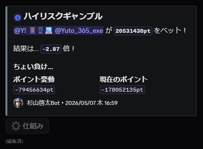

<div align="center">
<h1>
  多機能ゲームBot (杉山啓太Bot)
  
  [](https://discordjs.dev/)
  [](https://www.typescriptlang.org/)
  [](https://www.postgresql.org/)
  [](LICENSE)
</h1>
会話要約、画像生成・加工、そしてオセロや四目並べといったゲーム機能など<br>
詰めるだけ詰め込んだだけのBot!!!<br>
<br>


<br>
<sub>このBotのギャンブルに沼った人.png</sub>
</div>
<br/>

</div>

## なんのためにつくった...?

クソ暇だった2025年GW。  
暇なので自分が思いつく限り面白そーなコマンドやゲーム機能を入れたBotをPython1枚3000行で作成ww  
一応分割して今に至ります。全然管理はできてないので今でも自分では意味わからん構成してる助けて。  

**2025/06/14 やまかわてるき鯖へのBeta版導入。** 今でも使われてる。そして今でもBeta版。(現在2026/06/21)  
**2026/10 TypeScript + discord.js に全面書き直し。全部の応答がComponents v2のカードになった。**  

## 軽い説明

会話要約、画像生成・加工、そしてオセロや四目並べといったゲーム機能を提供します。  
色々コマンドはあるのでリスト参考にしてもらって遊んでみてください。  
**コマンドの実行は、許可されたチャンネル内でコマンド名と引数を入力するだけで行えます！！**  

## コマンドリスト

### ゲーム機能
*   `othello (@相手ユーザー)`:
    *   `othello`: オセロの対戦相手を募集します。盤面サイズ(6x6, 8x8, 10x10)を選択可能です。
    *   `othello @メンション`: 指定したユーザーと対戦します。
*   `connectfour (@相手ユーザー)` (または `cf`): 四目並べの対戦を開始します。
*   `janken`: じゃんけんゲームを開始します。ボタンで手を決定し、ポイントを賭けて勝負します。
*   `gamble`: 所持ポイントを賭けたハイリスク・ハイリターンなギャンブルを行います。
*   `bet [金額]`: ポイントを賭けてシンプルなダイスゲームを行います。
*   `login`: 1日1回、ログインボーナス（ポイント）を受け取ります。
*   `give [相手] [金額]`: 他のユーザーにポイントを送金します（手数料あり）。

*   `leave`: 進行中のゲームから投了・離脱します。
*   `point`: 現在のゲームポイントとランキングを表示します。

### 画像・メディア機能
*   `text [文字列]`: 指定スタイル（黄色・黒縁）でテキスト画像を生成します。末尾に `square` をつけると正方形スタンプ化します。
*   `text2 [文字列]`: 青色スタイルのテキスト画像を生成します。
*   `text3 [文字列]`: 赤色・明朝体スタイルのテキスト画像を生成します。
*   `text4 [文字列] square`: 特殊な変形を加えたテキスト画像を生成します（正方形のみ）。
*   `text5 [文字列] square`: 虹色グラデーションのテキスト画像を生成します（正方形のみ）。
*   `watermark`: 画像を添付して実行すると、ランダムなテンプレートを用いてウォーターマークを合成します。
*   `gaming`: 画像を添付して実行すると、ゲーミング風（七色に光る）GIFアニメーションに変換します。
*   `5000 [上文字列] [下文字列]`: 「5000兆円欲しい！」風のロゴ画像を生成します。
*   `voice [テキスト]`: VoiceVox APIとRVCボイチェンを使用して、テキストを音声ファイル(WAV)に変換して送信します。

### ユーティリティ・その他
*   `/imakita`: (スラッシュコマンド) 過去30分のチャットログをAI (DeepSeek) が3行で要約します。
*   `tenki [都市名]`: 指定された日本の都市の天気予報を表示します。DeepSeekによる都市名の推測補完に対応しています。
*   `rate [金額] [通貨コード]`: 指定した外貨を現在のレートで日本円に換算します。
*   `time (国コード)`: 世界時計を表示します。コードなしの場合は日本時間を表示します。
*   `info (@ユーザー)`: ユーザーの詳細情報（ID、作成日、バッジ、ロール等）を表示します。
*   `totusi [文字列]`: 「突然の死」風のアスキーアートを生成します。
*   `ping`: Botの応答速度を表示します。
*   `setchannel` (管理者のみ): 現在のチャンネルでのBot利用を許可/禁止します。

## ディレクトリ構成

```text
.
├── package.json             # 依存ライブラリ一覧
├── src/
│   ├── index.ts             # 起動・入力の受け付け
│   ├── commands/            # コマンド定義・入力フォーム
│   ├── games/               # ゲームロジック
│   ├── services/            # AI・画像処理・音声・ネットワーク機能
│   ├── data/                # データ保存 (SQLite / PostgreSQL)
│   └── ui/                  # Discord UI (Components v2)
├── assets/                  # アセットフォルダ
│   ├── fonts/               # フォントファイル (必須)
│   │   ├── MochiyPopOne-Regular.ttf
│   │   └── NotoSerifJP-Black.ttf
│   └── watermark_templates/ # ウォーターマーク用画像 (必須)
└── .github/                 # コンテナ公開ワークフロー
```

## 導入手順

### ライブラリ
```bash
npm ci
npm run build
```

### 環境変数
```env
DISCORD_BOT_TOKEN=
DISCORD_APPLICATION_ID=
DEEPSEEK_API_KEY=
VOICEVOX_API_KEY=
DATA_DIR=/app/state
```
※rootに作成

## コンテナ運用

`main` ブランチへの push により GitHub Actions が `ghcr.io/y-exe/games-bot` の
`latest` とコミット SHA タグを更新します。永続化したいデータは `DATA_DIR` に保存されます。

### ローカル検証

Docker Desktop を起動した状態で、`.env.example` を `.env` にコピーして
`DISCORD_BOT_TOKEN` を設定し、次を実行します。

```bash
docker compose up --build
```

ローカルの Bot データは Docker volume `games-bot-data` に保存されます。停止は
`docker compose down`、データも削除する場合だけ `docker compose down --volumes` を使います。

## クレジット・使用API

*   **DeepSeek API:** チャット要約、地名推測など
*   **VoiceVox (Web API):** テキスト読み上げ
*   **RVC:** やまかわボイチェン（音声変換）
*   **つくもAPI:** 天気予報データ
*   **Exchange Rate API:** 為替レート
*   **5000兆円欲しい！API** 

## ライセンス

[GPL-3.0](LICENSE)  
改変した後、ネットワーク経由でユーザーにサービスを提供する場合、ソースコードの公開義務が発生します。

---

© 2026 yexe
